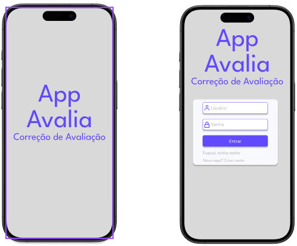
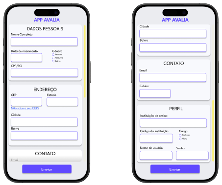
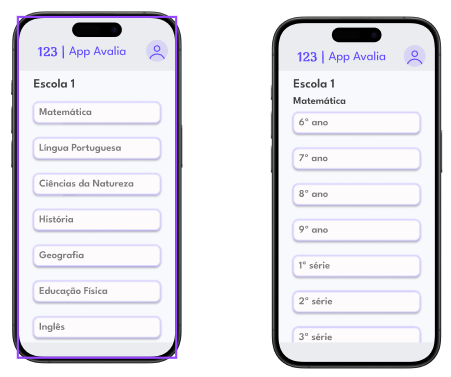
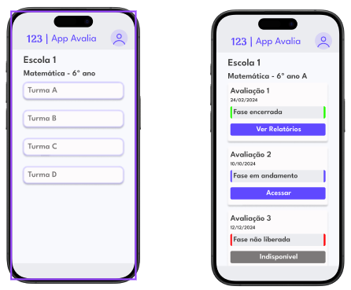

# Wireframes iniciais

## Planejamento

### Informações que as telas devem conter
- Login:
    - Nome de usuário
    - Código da Instituição
    - Senha
    - Pergunta de Recuperação de Senha

- Cadastro de usuário:
    - Dados pessoais: Nome completo, Data de nascimento,  
    Gênero, CPF
    - Endereço: CEP, “Não sabe o seu CEP?”, Estado,  
    Cidade e Bairro
    - Contato: Email, Celular, Telefone fixo
    - Perfil: Instituição de ensino, Código da Instituição,  
    Cargo (Professor | Aluno), Nome de usuário, Senha

- Cadastro de atividades:
    - Login do professor
    - Listagem de avaliações
        - Nome da escola que a turma pertence 
        - Nome da turma 
        - Lista de todas as avaliações 
            - Para cada avaliação: 
            - Nome da fase 
            - Data da fase 
            - Status da fase 
    - Leitura automatizada

- Cores principais:
    - 6049FF
    - F8F9FD
    - EBECF0

- Fonte: League Spartan

## Telas prontas

### Tela inicial para login.

### Tela de cadastro para novos usuários

### Seleção da disciplina, ano e turma para o cadastro/visualização da avaliação e Tela de avaliações já cadastradas, em andamentos e futuras.

 